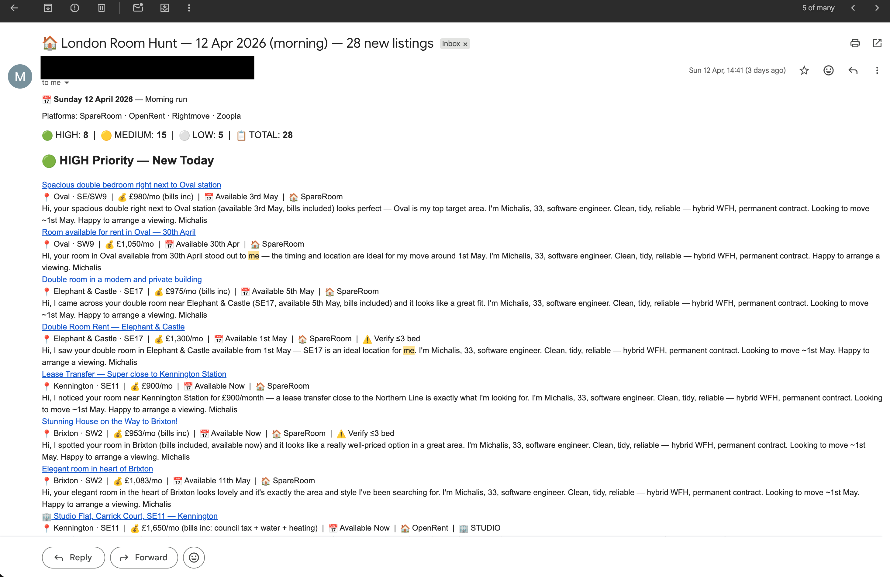

# London Property Hunt — Automated with Claude Cowork

An AI-powered workflow that searches London rental platforms twice a day, tracks listings in a spreadsheet, generates personalised outreach messages, and emails you a formatted summary — fully automatically.

---

## Example output

Every run sends you an email like this — clickable listings, ready-to-send outreach messages, and a backlog of uncontacted leads:



---

## What it does

1. **Searches 4 platforms** — SpareRoom, OpenRent, Rightmove, Zoopla — across your target areas
2. **Deduplicates** against your tracker spreadsheet (URL-based, O(1) lookup)
3. **Prioritises** listings as HIGH / MEDIUM / LOW based on your criteria
4. **Generates personalised outreach `.txt` files** for every HIGH priority listing
5. **Emails you a summary** with clickable cards, ready-to-send messages, and a backlog of uncontacted leads

Runs on a cron schedule (e.g. 9 AM and 6 PM daily). Human effort required: zero between runs.

---

## Repository structure

```
london-property-hunt/
├── README.md              ← you are here
├── skill.md               ← the main Claude Code skill (copy-paste into your setup)
├── config.example.md      ← fill in your personal config here
├── case-study.md          ← write-up of how this workflow was built and what it produced
├── tracker/
│   └── README.md          ← spreadsheet column schema and setup instructions
├── outreach/              ← generated outreach .txt files land here (gitignored)
└── .gitignore
```

---

## Requirements

- **Claude Code** (CLI or desktop app) — [claude.ai/code](https://claude.ai/code)
- **Claude in Chrome** MCP extension — for browser automation (SpareRoom, OpenRent, etc.)
- **Gmail MCP connector** — for draft creation and sending
- **Python 3 + openpyxl** — for spreadsheet updates (`pip install openpyxl`)
- A Gmail account you can grant MCP access to

---

## Setup

### 1. Clone and configure

```bash
git clone https://github.com/YOUR_USERNAME/london-property-hunt
cd london-property-hunt
cp config.example.md config.md
```

Edit `config.md` — fill in your name, target areas, budget, move-in date, and email.

### 2. Create your tracker spreadsheet

```bash
mkdir -p ~/London-Room-Hunt/outreach
```

On first run the skill creates the spreadsheet automatically at the path in your config. Or create it manually — see [tracker/README.md](tracker/README.md) for the column schema.

### 3. Install the skill in Claude Code

Copy the contents of `skill.md` and paste it as a new skill in Claude Code, or point your Claude Code config at this file.

Alternatively, run it manually:

```
claude "Run the London property hunt — search all platforms, update tracker, send email"
```

### 4. Schedule it

In Claude Code, use `/schedule` to run it twice a day:

```
/schedule 0 9,18 * * * Run the London property hunt skill
```

---

## How the search works

### Type A — Rooms in shared flats

- Furnished double rooms, max 3-bedroom properties
- Flatmates: professionals preferred (28–40), students/under-25 skipped or flagged LOW
- Budget: up to your configured max (bills included preferred)

**Bed count filter (mandatory):**
| Stated beds | Action |
|---|---|
| 2-bed or 3-bed | ADD ✅ |
| 4-bed, 5-bed, 6-bed+ | SKIP ❌ |
| Unknown | ADD with note "Verify ≤3 bed before messaging" |

### Type B — Studios and 1-bedroom flats

- Whole-unit lets, furnished, no bed count restriction
- Budget: up to your configured studio max

---

## Priority logic

**Rooms:**
- **HIGH** — Prime areas + ≤ budget + available by move-in ± 1 week + furnished + ≤3 bed + flatmates 28+ (or unconfirmed)
- **MEDIUM** — Secondary areas within budget, or prime area with minor flags
- **LOW** — Late availability, outer areas, student flat, confirmed 4+ beds

**Studios:**
- **HIGH** — Zone 1–2 South + ≤ budget + available by move-in + furnished
- **MEDIUM** — Zone 2–3 within budget and timing
- **LOW** — Late availability or outer areas

Row colours in spreadsheet: HIGH = green (`E2EFDA`), MEDIUM = yellow (`FFFFC7`), LOW = red (`FCE4D6`)

---

## Email format

Every run sends an HTML email (even if zero new listings) with:

- **Header** — date, run time, platform counts, HIGH/MEDIUM/LOW totals
- **HIGH listings** — card per listing with a green ready-to-send outreach message (<100 words, personalised)
- **MEDIUM listings** — condensed cards with short outreach
- **LOW/SKIP** — bullet list only
- **Backlog** — up to 8 uncontacted HIGH listings from previous runs, with outreach cards
- **Stats** — area breakdown, days until move-in, "message at least 5 listings today" reminder

---

## Adapting for your own search

The only file you need to edit is `config.md` (copied from `config.example.md`). Everything else — search URLs, priority logic, outreach tone, email format — reads from that config.

Key things to configure:

| Field | Example |
|---|---|
| Your name | Alex |
| Age | 29 |
| Brief profile | Software engineer, clean, professional |
| Work postcode | EC2A 1NT |
| Target areas | Hackney, Shoreditch, Bethnal Green |
| Budget (room) | £1,500 pcm |
| Budget (studio) | £1,800 pcm |
| Move-in date | 1 June 2026 |
| Email | you@gmail.com |
| Hunt directory | ~/my-room-hunt |

---

## Case study

See [case-study.md](case-study.md) for a full write-up: how this was built, what techniques were used (structured JSON extraction, DOM-as-buffer trick, idempotent dedup), and the numbers from a real run (230 listings found, 132 HIGH priority, 132 outreach files generated, in ~45 minutes).

---

## Tips for standing out as a tenant

1. **Message fast** — be in the first 5 replies on SpareRoom
2. **Be specific** — reference something from the listing, not a generic template
3. **Phone over message** — if a number is listed, call
4. **Commit quickly** — if you like it, say so in the viewing
5. **References ready** — employer reference and previous landlord contact, sendable same-day
6. **Weekend mornings** — best time for new listings (Friday night + Saturday morning flood)

---

*Built with Claude Code + Claude in Chrome + Gmail MCP*
*Generated: April 2026*
